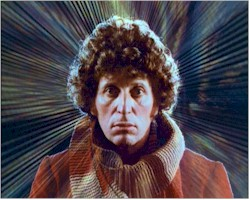

  Doctor Who Transcripts - Fourth Doctor Episode listing

<table width="100%" border="0"><tbody><tr><td colspan="3" width="622"><h1 align="center">The Doctor Who Transcripts - 4th Doctor Episode Listings</h1></td></tr><tr><td width="290"></td><td width="622"><h2 align="center">Fourth Doctor - Tom Baker</h2></td><td width="28%"></td></tr><tr><td width="290" valign="top"><table style="width: 284px;" width="100%" border="0"><tbody><tr><td width="276"></td></tr><tr><td width="276"> </td></tr><tr><td width="276"><b><a href="index.html" style="color: rgb(0, 0, 0);">Doctor Who Home</a></b></td></tr><tr><td width="276"><b><a href="../StarTrek/index.html" style="color: rgb(0, 0, 0);">Star Trek Home</a></b></td></tr></tbody></table> </td><td width="622" valign="top">&lt;<table width="796" height="1309" cellspacing="4" border="1" bgcolor="#d5d5d5"><tbody><tr><td width="229" valign="top" bgcolor="#006b9f">
<b>Episode Name</b>
</td><td width="182" valign="top" bgcolor="#006b9f">
<b>Production</b>
</td><td width="181" valign="top" bgcolor="#006b9f">
<b>Airdate</b>
</td></tr><tr><td align="center" bgcolor="#eeeeee"><a href="12-1.htm">Robot</a></td><td align="center" width="182" bgcolor="#eeeeee">4A</td><td align="center" width="181" bgcolor="#eeeeee">28 Dec, 1974</td></tr><tr><td align="center" bgcolor="#eeeeee"><a href="12-2.htm">The Ark in Space</a></td><td align="center" width="182" bgcolor="#eeeeee">4C</td><td align="center" width="181" bgcolor="#eeeeee">25 Jan, 1975</td></tr><tr><td align="center" bgcolor="#eeeeee"><a href="12-3.htm">The Sontaran Experiment</a></td><td align="center" width="182" bgcolor="#eeeeee">4B</td><td align="center" width="181" bgcolor="#eeeeee">22 Feb, 1975</td></tr><tr><td align="center" bgcolor="#eeeeee"><a href="12-4.htm">Genesis of the Daleks</a></td><td align="center" width="182" bgcolor="#eeeeee">4E</td><td align="center" width="181" bgcolor="#eeeeee">8 Mar, 1975</td></tr><tr><td align="center" bgcolor="#eeeeee"><a href="12-5.htm">Revenge of the Cybermen</a></td><td align="center" width="182" bgcolor="#eeeeee">4D</td><td align="center" width="181" bgcolor="#eeeeee">19 Apr, 1975</td></tr><tr><td align="center" bgcolor="#eeeeee"><a href="13-1.htm">Terror of the Zygons</a></td><td align="center" width="182" bgcolor="#eeeeee">4F</td><td align="center" width="181" bgcolor="#eeeeee">30 Aug, 1975</td></tr><tr><td align="center" bgcolor="#eeeeee"><a href="13-2.htm">Planet of Evil</a></td><td align="center" width="182" bgcolor="#eeeeee">4H</td><td align="center" width="181" bgcolor="#eeeeee">27 Sep, 1975</td></tr><tr><td align="center" bgcolor="#eeeeee"><a href="13-3.htm">Pyramids of Mars</a></td><td align="center" width="182" bgcolor="#eeeeee">4G</td><td align="center" width="181" bgcolor="#eeeeee">25 Oct, 1975</td></tr><tr><td align="center" bgcolor="#eeeeee"><a href="13-4.htm">The Android Invasion</a></td><td align="center" width="182" bgcolor="#eeeeee">4J</td><td align="center" width="181" bgcolor="#eeeeee">22 Nov, 1975</td></tr><tr><td align="center" bgcolor="#eeeeee"><a href="13-5.htm">The Brain of Morbius</a></td><td align="center" width="182" bgcolor="#eeeeee">4K</td><td align="center" width="181" bgcolor="#eeeeee">3 Jan, 1976</td></tr><tr><td align="center" bgcolor="#eeeeee"><a href="13-6.htm">The Seeds of Doom</a></td><td align="center" width="182" bgcolor="#eeeeee">4L</td><td align="center" width="181" bgcolor="#eeeeee">31 Jan, 1976</td></tr><tr><td align="center" bgcolor="#eeeeee"><a href="14-1.htm">The Masque of Mandragora</a></td><td align="center" width="182" bgcolor="#eeeeee">4M</td><td align="center" width="181" bgcolor="#eeeeee">4 Sep, 1976</td></tr><tr><td align="center" bgcolor="#eeeeee"><a href="14-2.htm">The Hand of Fear</a></td><td align="center" width="182" bgcolor="#eeeeee">4N</td><td align="center" width="181" bgcolor="#eeeeee">2 Oct, 1976</td></tr><tr><td align="center" bgcolor="#eeeeee"><a href="14-3.htm">The Deadly Assassin</a></td><td align="center" width="182" bgcolor="#eeeeee">4P</td><td align="center" width="181" bgcolor="#eeeeee">30 Oct, 1976</td></tr><tr><td align="center" bgcolor="#eeeeee"><a href="14-4.htm">The Face of Evil</a></td><td align="center" width="182" bgcolor="#eeeeee">4Q</td><td align="center" width="181" bgcolor="#eeeeee">1 Jan, 1977</td></tr><tr><td align="center" bgcolor="#eeeeee"><a href="14-5.htm">The Robots of Death</a></td><td align="center" width="182" bgcolor="#eeeeee">4R</td><td align="center" width="181" bgcolor="#eeeeee">29 Jan, 1977</td></tr><tr><td align="center" bgcolor="#eeeeee"><a href="14-6.htm">The Talons of Weng-Chiang</a></td><td align="center" width="182" bgcolor="#eeeeee">4S</td><td align="center" width="181" bgcolor="#eeeeee">26 Feb, 1977</td></tr><tr><td align="center" bgcolor="#eeeeee"><a href="15-1.htm">Horror of Fang Rock</a></td><td align="center" width="182" bgcolor="#eeeeee">4V</td><td align="center" width="181" bgcolor="#eeeeee">3 Sep, 1977</td></tr><tr><td align="center" bgcolor="#eeeeee"><a href="15-2.htm">The Invisible Enemy</a></td><td align="center" width="182" bgcolor="#eeeeee">4T</td><td align="center" width="181" bgcolor="#eeeeee">1 Oct, 1977</td></tr><tr><td align="center" bgcolor="#eeeeee"><a href="15-3.htm">Image of the Fendahl</a></td><td align="center" width="182" bgcolor="#eeeeee">4X</td><td align="center" width="181" bgcolor="#eeeeee">29 Oct, 1977</td></tr><tr><td align="center" bgcolor="#eeeeee"><a href="15-4.htm">The Sun Makers</a></td><td align="center" width="182" bgcolor="#eeeeee">4W</td><td align="center" width="181" bgcolor="#eeeeee">26 Nov, 1977</td></tr><tr><td align="center" bgcolor="#eeeeee"><a href="15-5.htm">Underworld</a></td><td align="center" width="182" bgcolor="#eeeeee">4Y</td><td align="center" width="181" bgcolor="#eeeeee">7 Jan, 1978</td></tr><tr><td align="center" bgcolor="#eeeeee"><a href="15-6.htm">The Invasion of Time</a></td><td align="center" width="182" bgcolor="#eeeeee">4Z</td><td align="center" width="181" bgcolor="#eeeeee">4 Feb, 1978</td></tr><tr><td align="center" bgcolor="#eeeeee"><a href="16-1.htm">The Ribos Operation</a></td><td align="center" width="182" bgcolor="#eeeeee">5A</td><td align="center" width="181" bgcolor="#eeeeee">2 Sep, 1978</td></tr><tr><td align="center" bgcolor="#eeeeee"><a href="16-2.htm">The Pirate Planet</a></td><td align="center" width="182" bgcolor="#eeeeee">5B</td><td align="center" width="181" bgcolor="#eeeeee">30 Sep. 1978</td></tr><tr><td align="center" bgcolor="#eeeeee"><a href="16-3.htm">The Stones of Blood</a></td><td align="center" width="182" bgcolor="#eeeeee">5C</td><td align="center" width="181" bgcolor="#eeeeee">28 Oct, 1978</td></tr><tr><td align="center" bgcolor="#eeeeee"><a href="16-4.htm">The Androids of Tara</a></td><td align="center" width="182" bgcolor="#eeeeee">5D</td><td align="center" width="181" bgcolor="#eeeeee">25 Nov, 1978</td></tr><tr><td align="center" bgcolor="#eeeeee"><a href="16-5.htm">The Power of Kroll</a></td><td align="center" width="182" bgcolor="#eeeeee">5E</td><td align="center" width="181" bgcolor="#eeeeee">23 Dec, 1978</td></tr><tr><td align="center" bgcolor="#eeeeee"><a href="16-6.htm">The Armageddon Factor</a></td><td align="center" width="182" bgcolor="#eeeeee">5F</td><td align="center" width="181" bgcolor="#eeeeee">20 Jan, 1979</td></tr><tr><td align="center" bgcolor="#eeeeee"><a href="17-1.htm">Destiny of the Daleks</a></td><td align="center" width="182" bgcolor="#eeeeee">5J</td><td align="center" width="181" bgcolor="#eeeeee">1 Sep, 1979</td></tr><tr><td align="center" bgcolor="#eeeeee"><a href="17-2.htm">City of Death</a></td><td align="center" width="182" bgcolor="#eeeeee">5H</td><td align="center" width="181" bgcolor="#eeeeee">29 Sep, 1979</td></tr><tr><td align="center" bgcolor="#eeeeee"><a href="17-3.htm">The Creature from the Pit</a></td><td align="center" width="182" bgcolor="#eeeeee">5G</td><td align="center" width="181" bgcolor="#eeeeee">27 Oct, 1979</td></tr><tr><td align="center" bgcolor="#eeeeee"><a href="17-4.htm">Nightmare of Eden</a></td><td align="center" width="182" bgcolor="#eeeeee">5K</td><td align="center" width="181" bgcolor="#eeeeee">24 Nov, 1979</td></tr><tr><td align="center" bgcolor="#eeeeee"><a href="17-5.htm">The Horns of Nimon</a></td><td align="center" width="182" bgcolor="#eeeeee">5L</td><td align="center" width="181" bgcolor="#eeeeee">22 Dec, 1979</td></tr><tr><td align="center" bgcolor="#eeeeee"><i><a href="17-6.htm">Shada</a></i></td><td align="center" width="182" bgcolor="#eeeeee"><i>5M</i></td><td align="center" width="181" bgcolor="#eeeeee"><i>not broadcast</i></td></tr><tr><td align="center" bgcolor="#eeeeee"><a href="18-1.htm">The Leisure Hive</a></td><td align="center" width="182" bgcolor="#eeeeee">5N</td><td align="center" width="181" bgcolor="#eeeeee">30 Aug, 1980</td></tr><tr><td align="center" bgcolor="#eeeeee"><a href="18-2.htm">Meglos</a></td><td align="center" width="182" bgcolor="#eeeeee">5Q</td><td align="center" width="181" bgcolor="#eeeeee">27 Sep, 1980</td></tr><tr><td align="center" bgcolor="#eeeeee"><a href="18-3.htm">Full Circle</a></td><td align="center" width="182" bgcolor="#eeeeee">5R</td><td align="center" width="181" bgcolor="#eeeeee">25 Oct, 1980</td></tr><tr><td align="center" bgcolor="#eeeeee"><a href="18-4.htm">State of Decay</a></td><td align="center" width="182" bgcolor="#eeeeee">5P</td><td align="center" width="181" bgcolor="#eeeeee">22 Nov, 1980</td></tr><tr><td align="center" bgcolor="#eeeeee"><a href="18-5.htm">Warriors' Gate</a></td><td align="center" width="182" bgcolor="#eeeeee">5S</td><td align="center" width="181" bgcolor="#eeeeee">3 Jan, 1981</td></tr><tr><td align="center" bgcolor="#eeeeee"><a href="18-6.htm">The Keeper of Traken</a></td><td align="center" width="182" bgcolor="#eeeeee">5T</td><td align="center" width="181" bgcolor="#eeeeee">31 Jan, 1981</td></tr><tr><td align="center" bgcolor="#eeeeee"><a href="18-7.htm">Logopolis</a></td><td align="center" width="182" bgcolor="#eeeeee">5V</td><td align="center" width="181" bgcolor="#eeeeee">28 Feb, 1981</td></tr><tr></tr></tbody></table> 
<big><b>Audio Adventures  (For lots more 4th Doctor Adventures, go to <a href="https://www.bigfinish.com/collections/v/the-fourth-doctor-collection">Big Finish 4th Doctor Collection</a></b></big>
<table width="795" cellspacing="4" border="1"><tbody><tr><td bgcolor="#006b9f" valign="top" width="320">
<b>Story title</b>
</td><td bgcolor="#006b9f" valign="top" width="200">
<b>Range</b>
</td><td bgcolor="#006b9f" valign="top" width="151">
<b>Release date</b>
</td></tr><tr><td align="center" bgcolor="#f5ffc4"><a href="HornetsNest1.html">The Stuff of Nightmares</a></td><td align="center" width="182" bgcolor="#f5ffc4">BBC Audio Hornets Nest set</td><td align="center" bgcolor="#f5ffc4">Sep 2009</td></tr><tr><td align="center" bgcolor="#f5ffc4"><a href="HornetsNest2.html">The Dead Shoes</a></td><td align="center" width="182" valign="top" bgcolor="#f5ffc4">BBC Audio Hornets Nest set</td><td align="center" bgcolor="#f5ffc4">Oct 2009</td></tr><tr><td align="center" bgcolor="#f5ffc4"><a href="HornetsNest3.html">The Circus of Doom</a></td><td align="center" width="182" bgcolor="#f5ffc4">BBC Audio Hornets Nest set</td><td align="center" bgcolor="#f5ffc4">Nov 2009</td></tr><tr><td align="center" bgcolor="#f5ffc4"><a href="HornetsNest4.html">A Sting in the Tale</a></td><td align="center" width="182" bgcolor="#f5ffc4">BBC Audio Hornets Nest set</td><td align="center" bgcolor="#f5ffc4">Dec 2009</td></tr><tr><td align="center" bgcolor="#f5ffc4"><a href="HornetsNest5.html">The Hive of Horror</a></td><td align="center" width="182" bgcolor="#f5ffc4">BBC Audio Hornets Nest set</td><td align="center" bgcolor="#f5ffc4">Dec 2009</td></tr><tr><td align="center" bgcolor="#f5ffc4"><a href="DemonQuest1.html">The Relics of Time</a></td><td align="center" bgcolor="#f5ffc4">BBC Audio Demon Quest set</td><td align="center" bgcolor="#f5ffc4">Sep 2010</td></tr><tr><td align="center" bgcolor="#f5ffc4"><a href="DemonQuest2.html">The Demon of Paris</a></td><td align="center" bgcolor="#f5ffc4">BBC Audio Demon Quest set</td><td align="center" bgcolor="#f5ffc4">Oct 2010</td></tr><tr><td align="center" bgcolor="#f5ffc4"><a href="DemonQuest3.html">A Shard of Ice</a></td><td align="center" bgcolor="#f5ffc4">BBC Audio Demon Quest set</td><td align="center" bgcolor="#f5ffc4">Nov 2010</td></tr><tr><td align="center" bgcolor="#f5ffc4"><a href="DemonQuest4.html">Starfall</a></td><td align="center" bgcolor="#f5ffc4">BBC Audio Demon Quest set</td><td align="center" bgcolor="#f5ffc4">Dec 2010</td></tr><tr><td align="center" bgcolor="#f5ffc4"><a href="DemonQuest5.html">Sepulchre</a></td><td align="center" bgcolor="#f5ffc4">BBC Audio Demon Quest set</td><td align="center" bgcolor="#f5ffc4">Dec 2010</td></tr><tr><td align="center" bgcolor="#f5ffc4"><a href="SerpentCrest1.html">Tsar Wars</a></td><td align="center" bgcolor="#f5ffc4">BBC Audio Serpent Crest set</td><td align="center" bgcolor="#f5ffc4">Sep 2011</td></tr><tr><td align="center" bgcolor="#f5ffc4"><a href="SerpentCrest2.html">The Broken Crown</a></td><td align="center" bgcolor="#f5ffc4">BBC Audio Serpent Crest set</td><td align="center" bgcolor="#f5ffc4">Oct 2011</td></tr><tr><td align="center" bgcolor="#f5ffc4"><a href="SerpentCrest3.html">Aladdin Time</a></td><td align="center" bgcolor="#f5ffc4">BBC Audio Serpent Crest set</td><td align="center" bgcolor="#f5ffc4">Nov 2011</td></tr><tr><td align="center" bgcolor="#f5ffc4"><a href="SerpentCrest4.html">The Hexford Invasion</a></td><td align="center" bgcolor="#f5ffc4">BBC Audio Serpent Crest set</td><td align="center" bgcolor="#f5ffc4">Dec 2011</td></tr><tr><td align="center" bgcolor="#f5ffc4"><a href="SerpentCrest5.html">Survivors in Space</a></td><td align="center" bgcolor="#f5ffc4">BBC Audio Serpent Crest set</td><td align="center" bgcolor="#f5ffc4">Dec 2011</td></tr></tbody></table></td></tr></tbody></table>

